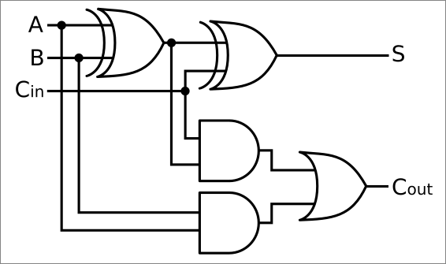
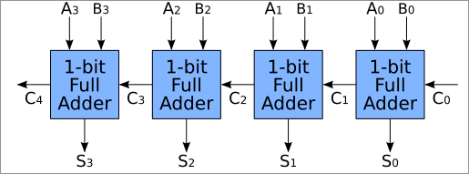

# Verilog Adders: Half, Full, and Ripple Carry

This repository contains implementations of three types of adders written in Verilog: Half Adder, Full Adder, and Ripple Carry Adder. Below, we will explain the theory behind each of them, along with their truth tables and schematic representations.

## 1. Half Adder

### Theory
A **Half Adder** is a combinational circuit that takes two single-bit binary inputs and produces two outputs: the sum (`S`) and the carry (`C`). The sum is the XOR of the two inputs, and the carry is the AND of the two inputs.

### Truth Table
| Input A | Input B | Sum (S) | Carry (C) |
|:-------:|:-------:|:-------:|:---------:|
|    0    |    0    |    0    |     0     |
|    0    |    1    |    1    |     0     |
|    1    |    0    |    1    |     0     |
|    1    |    1    |    0    |     1     |

### Boolean Expressions
The sum and carry for a half adder are given by the following Boolean equations:
\[
S = A \oplus B
\]
\[
C = A \cdot B
\]

### Schematic

## 2. Full Adder

### Theory
A **Full Adder** adds three single-bit binary numbers: two input bits (`A`, `B`) and a carry-in (`C_{in}`). It produces a sum (`S`) and a carry-out (`C_{out}`). The sum is the XOR of the three inputs, and the carry-out is determined by multiple conditions where the inputs generate a carry.

### Truth Table
| Input A | Input B | Carry In \(C_{in}\) | Sum (S) | Carry Out \(C_{out}\) |
|:-------:|:-------:|:--------------------:|:-------:|:---------------------:|
|    0    |    0    |          0           |    0    |           0           |
|    0    |    0    |          1           |    1    |           0           |
|    0    |    1    |          0           |    1    |           0           |
|    0    |    1    |          1           |    0    |           1           |
|    1    |    0    |          0           |    1    |           0           |
|    1    |    0    |          1           |    0    |           1           |
|    1    |    1    |          0           |    0    |           1           |
|    1    |    1    |          1           |    1    |           1           |

### Boolean Expressions
The sum and carry-out are given by:
\[
S = A \oplus B \oplus C_{in}
\]
\[
C_{out} = (A \cdot B) + (B \cdot C_{in}) + (A \cdot C_{in})
\]

### Schematic

## 3. Ripple Carry Adder

### Theory
A **Ripple Carry Adder** is constructed by cascading multiple full adders together. It is used to add multi-bit binary numbers. Each full adder processes two bits from the numbers, and the carry-out from one full adder is the carry-in for the next one.

For an \(n\)-bit Ripple Carry Adder, we have \(n\) full adders. The sum and carry propagate through the chain, which is why it is called a "ripple carry" adder.

### Example for 4-bit Ripple Carry Adder
In a 4-bit ripple carry adder, we have 4 full adders. The input bits \(A_3 A_2 A_1 A_0\) and \(B_3 B_2 B_1 B_0\) are added together, and the carry ripples through each stage. The final sum is given by:
\[
S = S_3 S_2 S_1 S_0
\]
Where each \(S_i\) is calculated by a full adder.

### Schematic

